# Installation

Installation to `Windows Server 2003` / `Windows Server 2008` / `Windows 7` / `Windows 8`, and _the above versions of Windows_ is recommended. _`Windows XP` and below_ **is not full supported**.

## 1 minute tutorial

1.  Download the newest version of PortableTrac:  https://github.com/thinkbase/PortableTrac/archive/master.zip;
    * See the two screenshots for reference: <br/>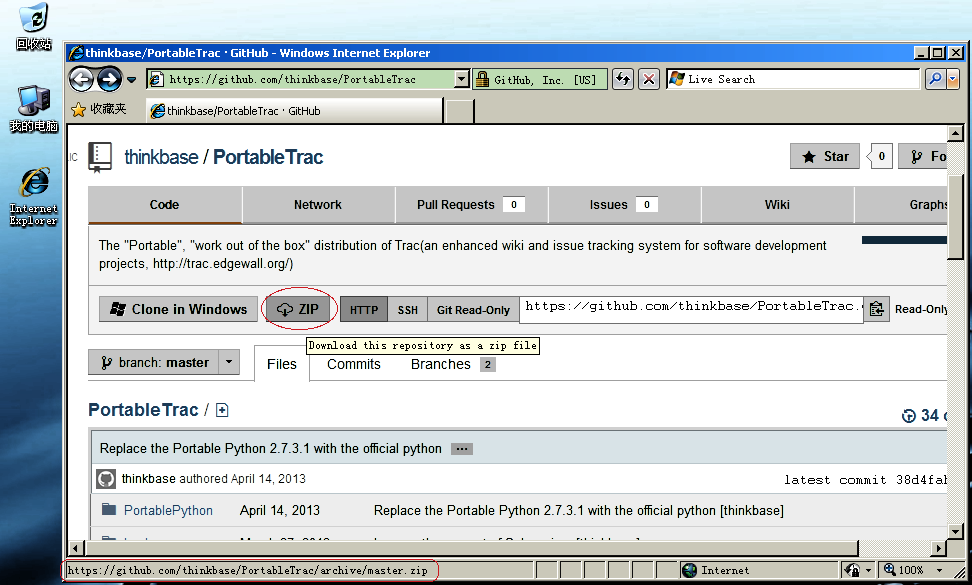 |  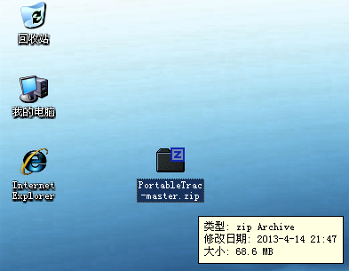
    
2.  Uncompress it into a folder: such as `C:\PortableTrac`(Or other your favorite folder name);
    *   This is the screenshot of `C:\PortableTrac`: <br/>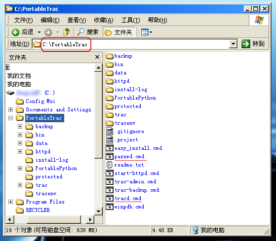

3.  Open a command prompt windows, `cd C:\PortableTrac`;

4.  run `passwd admin 111111`;
    *   _This command create password of user `admin` as `111111`_;
    *   The example: screenshot: <br/>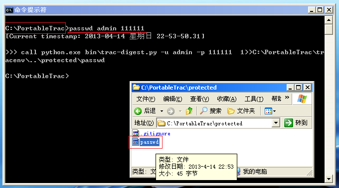

5.  run `tracd 8080 default`
    *   _This command start `tracd` for "default" environment, at port 8080_;
    *   See the screenshots: <br/> 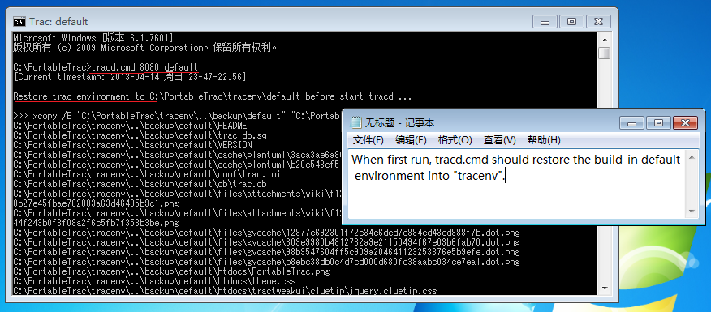 |  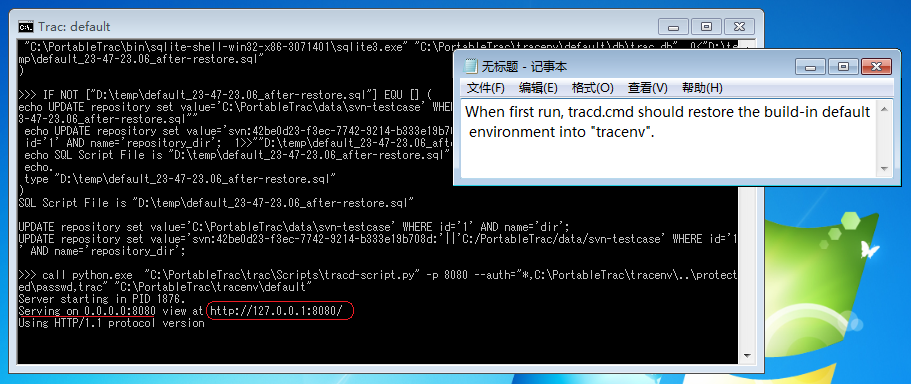

6.  Open browser and navigate to `http://localhost:8080`.
    *   See the screenshots: <br> 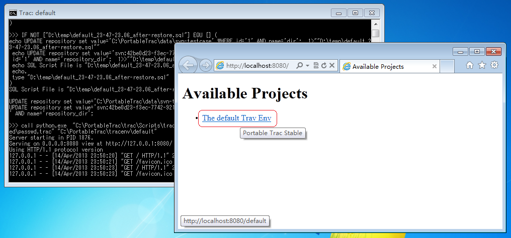 |  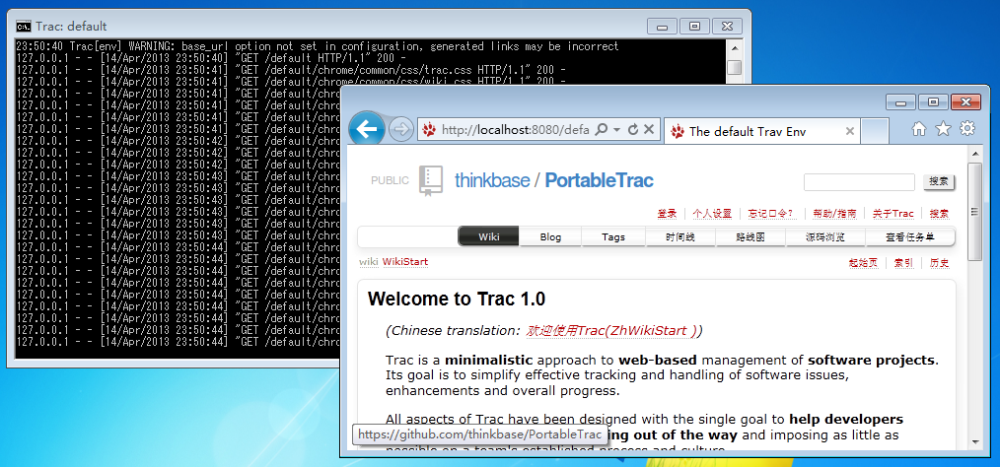

::: warning
Subversion Intergration is not supported in Windows XP
:::

## Run trac with apache httpd

If you finish the 1 minute tutorial _(see [above](#_1-minute-tutorial))_ , you can easy start the apache httpd just run the batch file `start-httpd.cmd`;

* The default port of apache httpd is 80, so you can access the Trac with URL `http://localhost/`;

* The screenshot: <br/> 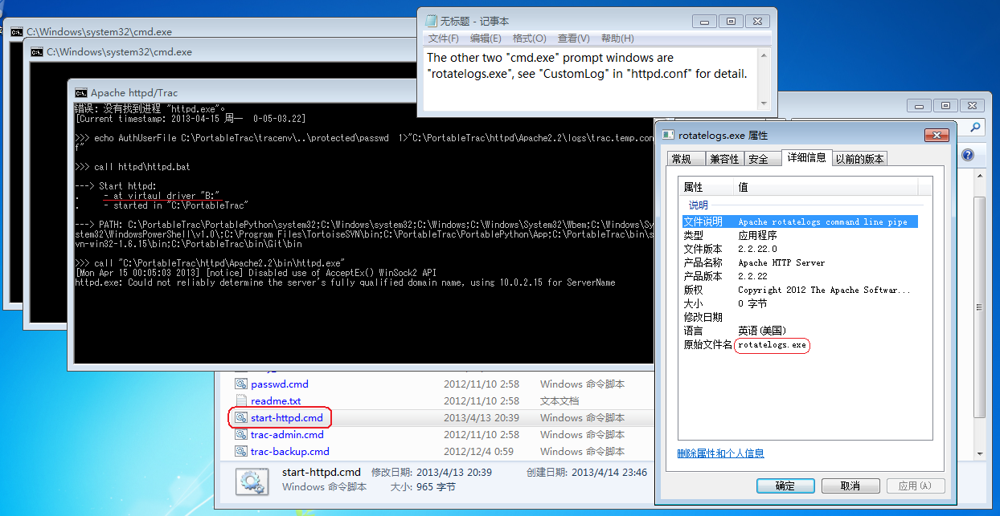

* `start-httpd.cmd` create a **virtual disk drive** `B:` for make apache httpd running portable(The idea from [The Mini Servers](http://www.wiki.uniformserver.com/index.php/Mini_Servers:_Introduction));

* process started with apache httpd is apache rotatelogs command line pipe _(rotatelogs.exe)_ , which break up apache logs into daily, configurated in [httpd.conf](https://github.com/thinkbase/PortableTrac/blob/master/httpd/Apache2.2/conf/httpd.conf):

  ```
  ErrorLog "|B:/Apache2.2/bin/rotatelogs.exe B:/Apache2.2/logs/error_%Y_%m_%d.log 86400 480″
  CustomLog "|B:/Apache2.2/bin/rotatelogs B:/Apache2.2/logs/%Y_%m_%d.access.log 86400 480" common
  ```

::: warning
Apache httpd is not supported in Windows XP
:::

## Change the default password of admin

After login(see screenshot): <br/> 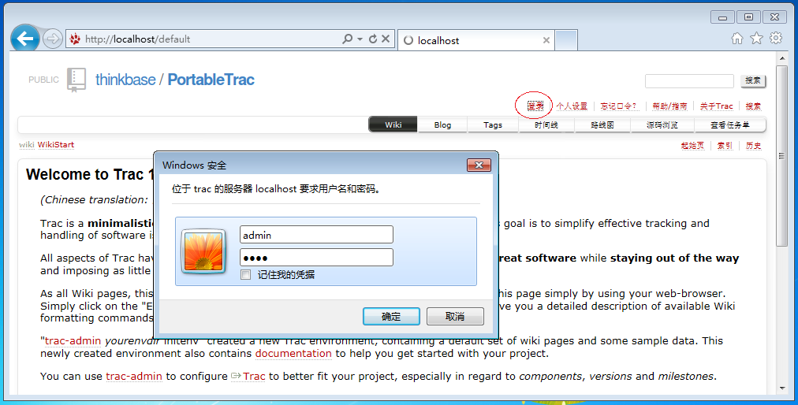,

you can change the admin's password by url `http://localhost/default/prefs/account` (see screenshot:)<br/> 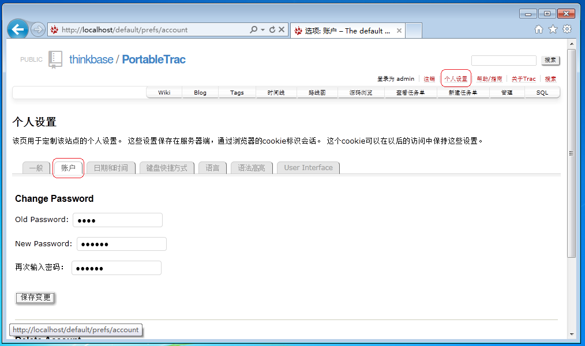

## Read more

*   [The Trac User and Administration Guide](http://www.thinkbase.net/trac/wiki/TracGuide)_([Chinese translation - Trac使用及管理指南](http://www.thinkbase.net/trac/wiki/ZhTracGuide))_;
*   [PortableTrac User Manual / 用户手册](./manual.html).


